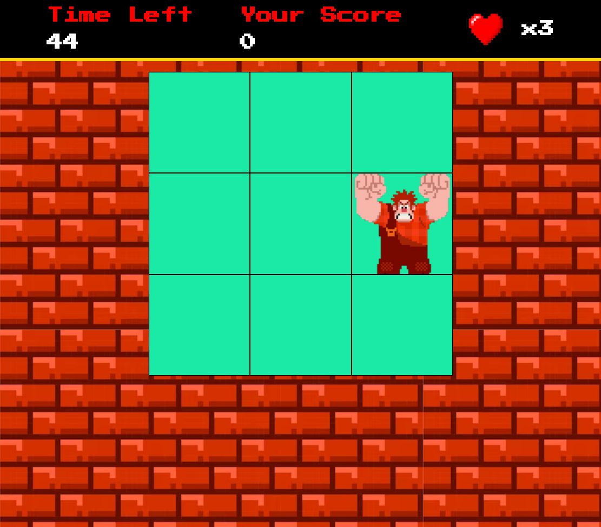

# Desafio Detona Ralph

Neste desafio é utilizado HTML, CSS e Javascript para criar um jogo baseado no filme Detona Ralph, aonde o objetivo é acertar o Ralph na janela que ele aparecer, ao longo do projeto é explorado eventos Javascript e manipular áudios no browser.

Desafio proposto pelo especialista DIO, Felipe Aguiar
